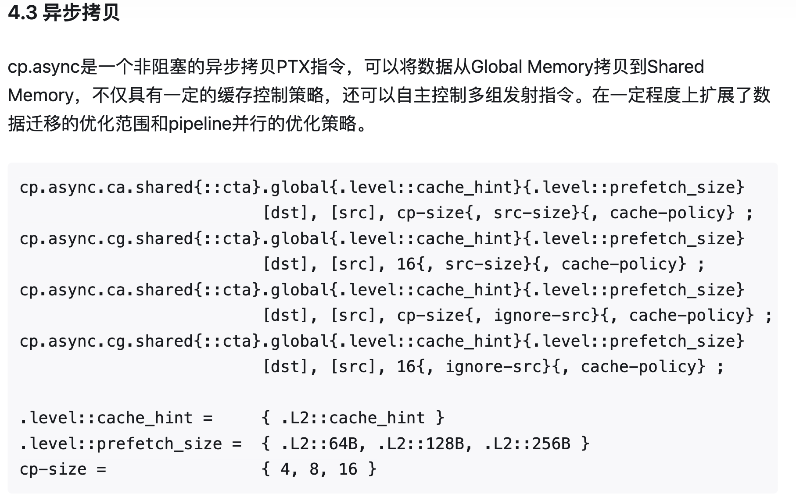
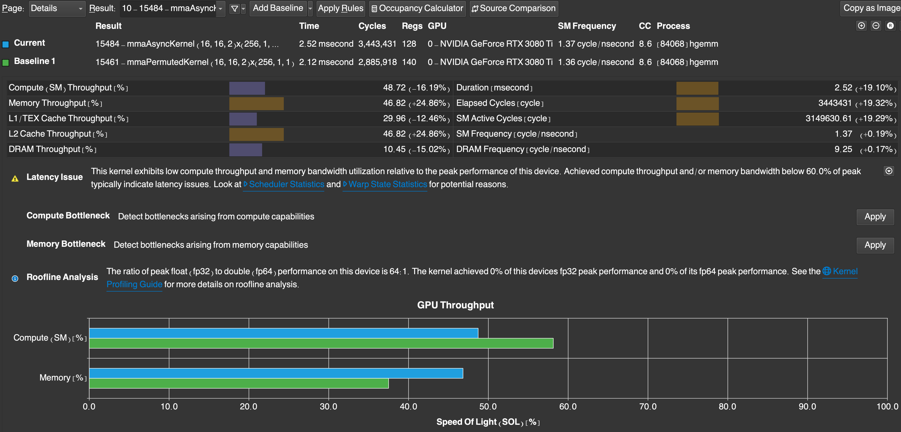

[toc]

## mma_async

与 mma_permute.cu 相比，async 版本唯一的改动就是数据从 global memory 到 shared memory 的异步拷贝，其他与 permute 版本无异。

### load Matrix A & B from HBM to SRAM

#### load A to SRAM

```c++
/* ============== async version ============= */
/* 
   only ldgsts A&B are different, 
   other operations are the same as permute version
*/
void __device__ __inline__ ldgstsA_async(const size_t warp_id, const size_t lane_id, 
                                         const half* A_warp_ptr, 
                                         size_t tile_k, size_t K, half* smemA) {

    const half *A_warp_tile = A_warp_ptr+tile_k*MMA_K;

    int lane_row = lane_id>>2, lane_col=lane_id&3; 
    float4* A_lane_ptr = (float4*)(A_WARP_TILE(lane_row, lane_col));

    size_t row_A = (warp_id<<5)+lane_row;
    size_t col_A = (lane_col+((row_A&7)>>1))&3;

    #pragma unroll
    for (size_t i = 0; i < 4; ++i) {
        // load current data
        uint32_t A_smem_lane_addr = __cvta_generic_to_shared(SMEMA(row_A,0)) + col_A*sizeof(float4);
        CP_ASYNC_CG(A_smem_lane_addr, A_lane_ptr, sizeof(float4));

        // prepare the next 8 rows 
        A_lane_ptr = (float4*)((half *)A_lane_ptr + LDGSTS_CP_ROWS*K);
        row_A += LDGSTS_CP_ROWS;
    }
}

```

#### load B to SRAM

```c++
void __device__ __inline__ ldgstsB_async(const size_t warp_id, const size_t lane_id, 
                                         const half* B_warp_ptr, 
                                         size_t tile_k, size_t K, half* smemB) {

    const half *B_warp_tile = B_warp_ptr+tile_k*MMA_K;

    int lane_row = lane_id&3, lane_col=lane_id>>2; 
    float4* B_lane_ptr = (float4*)(B_WARP_TILE(lane_row, lane_col));

    size_t row_B = (warp_id<<4)+lane_col;
    size_t col_B = (lane_row+((row_B&7)>>1))&3;

    #pragma unroll
    for (size_t i = 0; i < 2; ++i) {
        // load current data
        uint32_t B_smem_lane_addr = __cvta_generic_to_shared(SMEMB(row_B,0)) + col_B*sizeof(float4);
        CP_ASYNC_CG(B_smem_lane_addr, B_lane_ptr, sizeof(float4));

        // prepare the next 8 rows 
        B_lane_ptr = (float4*)((half *)B_lane_ptr + LDGSTS_CP_ROWS* K);
        row_B += LDGSTS_CP_ROWS;
    }
}
```


* 这里需要解释一下三个宏定义 CP_ASYNC_CG, CP_ASYNC_COMMIT_GROUP 和 CP_ASYNC_WAIT_GROUP

  ```c++
  // ptx.h 文件
  #define CP_ASYNC_CG(dst, src, Bytes) \
      asm volatile("cp.async.cg.shared.global [%0], [%1], %2;\n" ::"r"(dst), "l"(src), "n"(Bytes))
  #endif
  
  #define CP_ASYNC_COMMIT_GROUP() asm volatile("cp.async.commit_group;\n" ::)
  
  #define CP_ASYNC_WAIT_GROUP(N) asm volatile("cp.async.wait_group %0;\n" ::"n"(N))
  ```

  **异步加载操作：**

  - 执行 `cp.async.ca.shared.global`，发起从全局内存到共享内存的异步数据传输。
  - 加载操作立即返回，不会阻塞后续指令。

  **提交加载组：**

  - 使用 `cp.async.commit_group` 将当前的加载操作组提交给硬件。

  **等待加载完成：**

  - 使用 `cp.async.wait_group` 等待数据传输完成，确保共享内存中的数据有效。

  **同步线程：**

  - 如果需要多个线程访问共享内存，可能还需要调用 `bar.sync` 或 `__syncthreads()` 进行同步。

* 关于 async，[木子知的知乎说明](https://zhuanlan.zhihu.com/p/639297098)如下

  

### Performance

测试的矩阵尺寸为 M=N=K=4096

Figure-1 是 permute 版本与 async 版本 ncu 性能指标的对比



<center> Figure-1 <center>


* 耗时2.52ms，相对于 permute 版本，时间还增加了

  * 由于异步拷贝，Memory 的 throughput 提升了 24.86%
  * cp.async.ca.shared.global 的优势在于隐藏数据传输延迟，将全局内存拷贝到共享内存的操作与计算部分并行
  * 由于没有真正将全局内存拷贝到共享内存的操作与计算并行，导致 compute throughput 性能降低
  * 如果计算量较小，（Compute-Bound 工作负载不足），即便提高了内存传输性能，也无法充分利用 GPU 的计算能力


