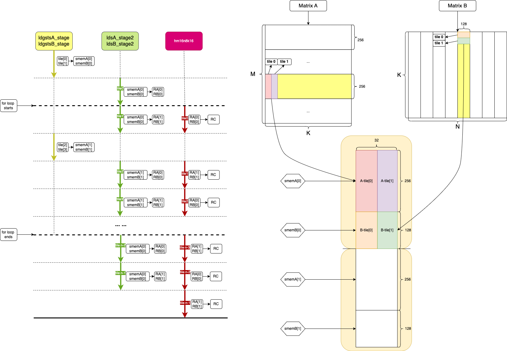

[toc]

## mma_async_stage2

与以往版本相比，mma_async_stage2 版本最大也是最重要的改动就是利用 double buffer 使得数据的加载与计算并行，这极大程度的提升了性能，也充分利用了数据的异步拷贝。

### pipline

Figure-1 mma_async_stage2 的 pipeline

 Figure-1 

* shared memory 和寄存器 RA/RB/RC 都有两部分组成，也就是 double buffer
* 首先获取 tile0 数据，在获取 tile1数据的同时计算 tile0 数据
* 数据从 global memory 到 shared memory 是异步进行，但从 shared memory 到寄存器依然是同步的
* 这里要解释一个问题（仅个人理解）
  * Q: 数据从 shared memory 到寄存器 RA 和 RB 调用 ldsA_stage2 和 ldsB_stage2，使用的是 ldmatrix.sync.aligned.x4.m8n8.shared.b16，然而这是一个同步指令，也就是说，warp 中所有线程只有在指令执行完后才能走到后面的计算，那为什么数据拷贝和计算还能实现并行？
  * A：尽管 `ldmatrix.sync` 和 `mma.sync` 是同步指令，它们的操作本质上独立，能通过硬件调度器实现时间上的重叠执行，从而提高整体性能。加载数据和计算操作实际是通过资源独立性和指令流水线实现的，由于内存加载单元和计算单元是独立的，Scheduler 可以交替调度加载和计算指令，使得数据加载和计算在 **时间上重叠**。虽然 warp 内的所有线程会一起等待数据加载完成，但其他 warp 可以在这一过程中利用空闲资源执行其他任务。**这是一种全局的并行，而非单一 warp 的并行**。
  * 其中有以下两个独立的过程：
    * 在硬件上，内存加载单元和计算单元资源独立，内存加载使用的是 shared memory 和寄存器，计算使用的是 Tensor core
    * 在代码上，在 double buffer 的加持下，加载的数据和计算的数据没有依赖关系，互相解耦，每轮加载和计算分别使用不同的寄存器索引

​					

### Performance

测试的矩阵尺寸为 M=N=K=4096

Figure-2 是 mma_async_stage2 版本与 mma_async 版本的 ncu 性能指标对比

 Figure-2 

* 耗时1.89 ms，相对于 mma_async 版本有本质提升
* memory throughput 和 compute throughput 都有较大提升

