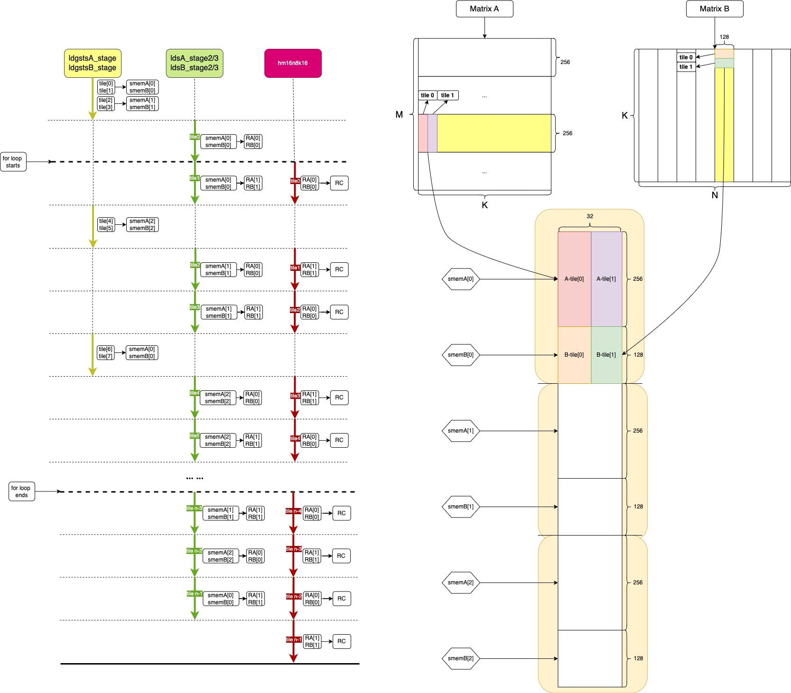
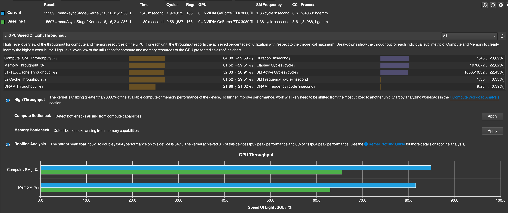

[toc]

## mma_async_stage3

相对于 mma_async_stage2 版本，mma_async_stage3 最重要的改动就是每次有两组 global memory 异步拷贝到 shared memory。


### pipline

Figure-1 mma_async_stage3 的 pipeline



<center> Figure-1 <center>

* 从流程图上仅仅可以看到最开始比 mma_async_stage2 多了一组的 global memory 拷贝

* 然而，由于 shared memory 比 mma_async_stage2 多了一组，所以 global memory 的拷贝可以变成两组异步的形式

  ```c++
      #pragma unroll
      for (size_t tile_k = CHUNK_K * (K_STAGE - 1); tile_k < K_tiles; tile_k += CHUNK_K) {
          reg_store_idx ^= 1;
          reg_load_idx ^= 1; // reg_load_idx=0
  
          #pragma unroll
          for (size_t i = 0; i < WARP_COL_TILES; ++i)
              ldsA_stage2(i, 1, reg_store_idx, smem_load_off, warp_id, lane_id, smemA, RA); 
  
          #pragma unroll
          for (size_t j = 0; j < WARP_ROW_TILES; ++j)
              ldsB_stage2(j, 1, reg_store_idx, smem_load_off, warp_id, lane_id, smemB, RB);
  
          /* IMPORTANT! parallel here */
          #pragma unroll
          for (size_t i = 0; i < WARP_COL_TILES; ++i) {
              #pragma unroll
              for (size_t j = 0; j < WARP_ROW_TILES; ++j)
                  hm16n8k16(i, j, reg_load_idx, RA, RB, RC);
          }
  
          smem_store_idx = (smem_store_idx + 1) % K_STAGE; // smem_store_idx=2
          smem_store_off = smem_store_idx * smem_stage_off;
  
          /* from HBM to SRAM */
          ldgstsA_stage(warp_id, lane_id, A_warp_ptr, tile_k, K, smemA, smem_store_off);
          ldgstsB_stage(warp_id, lane_id, B_warp_ptr, tile_k, K, smemB, smem_store_off);
  
          CP_ASYNC_COMMIT_GROUP();
          CP_ASYNC_WAIT_GROUP(1);
  
          __syncthreads();
  
          reg_store_idx ^= 1;
          reg_load_idx ^= 1; // reg_load_idx=1
  
          smem_load_idx = (smem_load_idx + 1) % K_STAGE;
          smem_load_off = smem_load_idx * smem_stage_off;
  
          #pragma unroll
          for (size_t i = 0; i < WARP_COL_TILES; ++i)
              ldsA_stage2(i, 0, reg_store_idx, smem_load_off, warp_id, lane_id, smemA, RA);
  
          #pragma unroll
          for (size_t j = 0; j < WARP_ROW_TILES; ++j)
              ldsB_stage2(j, 0, reg_store_idx, smem_load_off, warp_id, lane_id, smemB, RB);
  
          /* IMPORTANT! parallel here */
          #pragma unroll
          for (size_t i = 0; i < WARP_COL_TILES; ++i) {
              #pragma unroll
              for (size_t j = 0; j < WARP_ROW_TILES; ++j)
                  hm16n8k16(i, j, reg_load_idx, RA, RB, RC);
          }
      }
  ```

  * **<font color='red'> 注意这里的 CP_ASYNC_WAIT_GROUP(1); 即两组 global memory 异步拷贝</font>**

* 仅这一个改动，极大地增加了 memory 的 throughput


### Performance

测试的矩阵尺寸为 M=N=K=4096

Figure-2 是 mma_async_stage3 版本与 mma_async_stage2 版本的 ncu 性能指标对比



<center> Figure-2 <center>
* 耗时1.45 ms，相对于 mma_async_stage2 版本有较大提升
* memory throughput 和 compute throughput 都有较大提升


