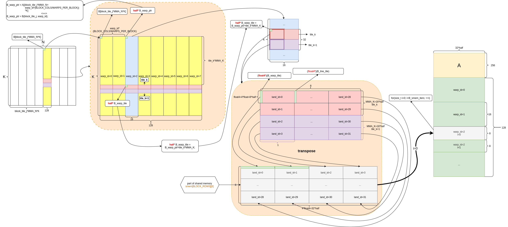

## mma_base

[toc]


### block swizzle

```c++
/* 
    block sizzle:
        index i is along col direction, j is along row direction
        block_tile_i is for the i-th tile(MMA level) rather than block level

        block shape=(256,128) 
        ==> for m16n8k16 tile, every block contains (256/m, 128/n)=(16,16) tiles
        ==> right shift 4 bits stands for multiply by 16 on both block_tile_i and block_tile_j
*/ 
__device__ __inline__ void swizzle(size_t* block_tile_i, size_t* block_tile_j) {
    *block_tile_i = (blockIdx.z & 1)?((gridDim.y-blockIdx.y-1)<<4):(blockIdx.y<<4);
    *block_tile_j = (blockIdx.z * gridDim.x + blockIdx.x)<<4;
}
```

- Figure-1是 C 矩阵在 block 层级的布局

  

<center> Figure-1 <center>

* 每计算 C 矩阵中的一个 block 需要 Figure-1 中 A 矩阵黄色区域以及 B 矩阵中的黄色区域

* C 矩阵中 block 的排列方式在图中用 (i, j) 标识

  * 图中 (i,j) 就是代码中的 block_tile_i 与 block_tile_j
  * block_tile_i 代表行，block_tile_j 代表列

* 这里的 (i, j) 表示的顺序就是 **swizzle** (这里 swizzle stride 是 16)

* 关于 swizzle 还有些隐藏的知识点

  * 每个 block 是 gpu scheduler 根据策略（看哪个 SM 上有空闲资源）**动态分配**给某个 SM 的，也就是说某个 block 可以分配给任意的 SM 

  * blockIdx.x, blockIdx.y 和 blockIdx.z 被分配的顺序是先 x 再 y 最后是 z，类似于下面的 for 循环

    ```c++
    printf("order of blocks: ");
    for(int z=0; z<gridDim.z; ++z)
      for(int y=0; y<gridDim.y; ++y)
        for(int x=0; x<gridDim.x; ++x)
          printf("(%d, %d, %d)",x,y,z);
    ```

  * Figure-1中 block 的顺序:  首先 z=0, (x,y) 对应到图中的 (i,j)，然后 z 每次累加，即可得到图中 block 的分配顺序

* 之所以要使用 swizzle 是为了提高L2 Cache命中率以下是[知乎作者木子知关于swizzle的具体描述](https://zhuanlan.zhihu.com/p/639297098)：

  


### load Matrix A & B from HBM to SRAM

#### load A to SRAM

```c++
#define LDGSTS_CP_NUM 8
#define A_WARP_TILE(i,j) (A_warp_tile+(i)*K+((j)<<3))
#define A(i,j) A[((i)*(MMA_M)+(j)*BLOCK_ROWS/WARPS_PER_BLOCK)*K]

// address of the specific row loading into SRAM
const half *A_warp_ptr = &A(block_tile_i, warp_id); 

/* Matrix A from HBM to SRAM */
__device__ void __inline__ ldgstsA_base(const size_t warp_id, 
                                        const size_t lane_id, const half* A_warp_ptr, 
                                        size_t tile_k, size_t K, half* smemA) {

    const half *A_warp_tile = A_warp_ptr+tile_k*MMA_K;

    /* 
        every single loop copy 8 rows and 4 cols ==> 
        lane_row = lane_id>>2 =[0,0,0,0, 1,1,1,1, ..., 7,7,7,7]
        lane_col = lane_id&3 = [0,1,2,3, 0,1,2,3, ..., 0,1,2,3]
     */
    int lane_row = lane_id>>2, lane_col=lane_id&3; 
    float4* A_lane_ptr = (float4*)(A_WARP_TILE(lane_row, lane_col));

    /* 
        every warp copy 32 rows from HBM to SRAM ==> warp_id<<5
        every time copy float4=8*half ==> col_A = (lane_id&3)<<3
     */
    size_t row_A = (warp_id<<5)+lane_row;
    size_t col_A = lane_col<<3;

    #pragma unroll
    for (size_t i = 0; i < 4; ++i) {
        // load current data
        *(float4*)(SMEMA(row_A, col_A)) = *A_lane_ptr;

        // prepare the next 8 rows
        A_lane_ptr = (float4*)((half *)A_lane_ptr + LDGSTS_CP_NUM*K);
        row_A += LDGSTS_CP_NUM;
    }
}
```

* Figure-2 是 A 矩阵 **(row-major)** 对应的计算部分从 global memory 搬移到 shared memory 


<center> Figure-2 <center>

* A 矩阵中的黄色部分由 8 个 warp 负责
  * 每次将 tile_k 和 tile_k+1 两个部分都搬移至 shared memory
  * shared memory 前面部分放矩阵 A，后半部分放矩阵 B
  * shared memory 中，矩阵 A占256行，每个 warp 负责32行


#### load B to SRAM

```c++
#define B_WARP_TILE(i,j) (B_warp_tile+(j)*K+((i)<<3))
#define B(i,j) B[((i)*(MMA_N)+(j)*BLOCK_COLS/WARPS_PER_BLOCK)*K]

// address of the specific row loading into SRAM
const half *B_warp_ptr = &B(block_tile_j, warp_id);

/* Matrix B from HBM to SRAM */
void __device__ __inline__ ldgstsB_base(const size_t warp_id, const size_t lane_id, const half* B_warp_ptr, 
                        size_t tile_k, size_t K, half* smemB) {

    const half *B_warp_tile = B_warp_ptr+tile_k*MMA_K;

    /* 
        every single loop copy 4 rows and 8 cols ==> 
        lane_row = lane_id&3 = [0,1,2,3, 0,1,2,3, ..., 0,1,2,3]
        lane_col = lane_id>>2 =[0,0,0,0, 1,1,1,1, ..., 7,7,7,7]
     */
    int lane_row = lane_id&3, lane_col=lane_id>>2; 
    float4* B_lane_ptr = (float4*)(B_WARP_TILE(lane_row, lane_col));

    /* 
        every warp copy 16 rows from HBM to SRAM ==> warp_id<<4
        every time copy float4=8*half ==> row_B = (lane_id&3)<<3
        Note: here is a transpose!
     */
    size_t row_B = (warp_id<<4)+lane_col;
    size_t col_B = lane_row<<3;

    #pragma unroll
    for (size_t i = 0; i < 2; ++i) {
        // load current data
        *(float4*)(SMEMB(row_B, col_B)) = *B_lane_ptr;

        // prepare the next 8 rows 
        B_lane_ptr = (float4*)((half *)B_lane_ptr + LDGSTS_CP_NUM* K);
        row_B += LDGSTS_CP_NUM;
    }
}
```

* Figure-3 是 B 矩阵 **(col-major)** 对应的计算部分从 global memory 搬移到 shared memory 



<center> Figure-3 <center>

* B 矩阵中的黄色部分由 8 个 warp 负责

  * 每次将 tile_k 和 tile_k+1 两个部分都搬移至 shared memory

  * shared memory 前面部分放矩阵 A，后半部分放矩阵 B

  * shared memory 中，矩阵 B占128行，每个 warp 负责16列

  * 与矩阵 A 不同
    * shared memory 中的矩阵 B 部分经过了一次 transpose
    * 在 shared memory 中，矩阵 B 变成了 row-major


### load Matrix A & B from SRAM to Register

* load A to Register

```c++
#define WARP_ROWS 64
#define SMEMA(i,j) (smemA+(i)*AB_SMEM_STRIDE+(j))

#define LDMATRIX_X4(R0, R1, R2, R3, addr)                                             \
    asm volatile("ldmatrix.sync.aligned.x4.m8n8.shared.b16 {%0, %1, %2, %3}, [%4];\n" \
                 : "=r"(R0), "=r"(R1), "=r"(R2), "=r"(R3)                             \
                 : "r"(addr))

/* 
    load Matrix A data from SRAM to Register:
    every block has 2x4 warps, which is 2 rows and 4 cols ==>
    warp_row = warp_id>>1 = [0,1]
    every warp can be split into 4 rows and 8 cols of mma, contains 64x64 half elements
    every mma is m16n8k16
*/
void __device__ __inline__ ldsA_base(int i, int k_step, 
                                const size_t warp_id, const size_t lane_id,
                                half* smemA, uint32_t RA[WARP_COL_TILES][4]) {

    size_t warp_row = (warp_id>>1)*WARP_ROWS + i*MMA_M;
    size_t warp_col = k_step*MMA_K;

    size_t lane_row = warp_row + (lane_id&15);
    size_t lane_col = warp_col + ((lane_id>>4)<<3); 

    uint32_t A_smem_lane_addr =
        __cvta_generic_to_shared(SMEMA(lane_row, lane_col));

    LDMATRIX_X4(RA[i][0], RA[i][1], RA[i][2], RA[i][3], A_smem_lane_addr);
}
```


* load B to Register

```c++
#define WARP_COLS 64
#define SMEMB(i,j) (smemB+(i)*AB_SMEM_STRIDE+(j))

#define LDMATRIX_X2(R0, R1, addr) \
    asm volatile("ldmatrix.sync.aligned.x2.m8n8.shared.b16 {%0, %1}, [%2];\n" : "=r"(R0), "=r"(R1) : "r"(addr))
#define SMEMB(i,j) (smemB+(i)*AB_SMEM_STRIDE+(j))

/* load Matrix B data from SRAM to Register */
void __device__ __inline__ ldsB_base(int j, int k_step, 
                                const size_t warp_id, const size_t lane_id,
                                half* smemB, uint32_t RB[WARP_COL_TILES][2]) {

    size_t warp_row = (warp_id&1)*WARP_COLS + j*MMA_N;
    size_t warp_col = k_step*MMA_K;

    size_t lane_row = warp_row + (lane_id&7);
    size_t lane_col = warp_col + (((lane_id>>3)&1)<<3); 

    uint32_t B_smem_lane_addr =
        __cvta_generic_to_shared(SMEMB(lane_row, lane_col));

    LDMATRIX_X2(RB[j][0], RB[j][1], B_smem_lane_addr);
}
```

* Figure-4 是 warp 的布局以及 shared memory 搬移到 Register

  

<center> Figure-4 <center>

* C 矩阵中的每个 block 尺寸为 256*128，每行有2个 warp，每列有4个 warp
* 每个 warp 尺寸大小为 64x64，每个 Tile 尺寸为16x8 ==> 每个 Warp 有 4x8 个 Tile
* 每个Tile计算需要的 A矩阵数据与 B 矩阵数据都已经在 shared memory 里
* 每个 Warp 计算 Tile 的顺序，如图中红色箭头所示，为了提高 Register 复用率（[知乎作者木子知关于提高寄存器重复利用率的具体描述](https://zhuanlan.zhihu.com/p/639297098)）：


### calc mma C=A@B

```c++
#define HMMA16816(RD0, RD1, RA0, RA1, RA2, RA3, RB0, RB1, RC0, RC1)                                                    \
    asm volatile("mma.sync.aligned.m16n8k16.row.col.f16.f16.f16.f16 {%0, %1}, {%2, %3, %4, %5}, {%6, %7}, {%8, %9};\n" \
                 : "=r"(RD0), "=r"(RD1)                                                                                \
                 : "r"(RA0), "r"(RA1), "r"(RA2), "r"(RA3), "r"(RB0), "r"(RB1), "r"(RC0), "r"(RC1))

/* calc hm16k8n16 */
void __device__ __inline__ hm16n8k16(int i, int j, 
                                    uint32_t RA[WARP_COL_TILES][4],
                                    uint32_t RB[WARP_ROW_TILES][2],
                                    uint32_t RC[WARP_COL_TILES][WARP_ROW_TILES][2]) {
    /* adopt Right Left Right Left style */
    size_t j_s = (i&1) ? (WARP_ROW_TILES - j - 1) : j;

    HMMA16816(RC[i][j_s][0], RC[i][j_s][1], 
              RA[i][0], RA[i][1], RA[i][2], RA[i][3], 
              RB[j_s][0], RB[j_s][1], 
              RC[i][j_s][0], RC[i][j_s][1]);
}
```

* Figure-5 是 mma 的计算


<center> Figure-5 <center>

* 这里的计算是 warp 级别的计算，并不只是单个 thread，要把 warp 看成一个整体
  * 所以计算需要的寄存器被分摊到 warp 中的每个 thread 里 

### load result from Register to SRAM

```c++
/* store Matrix C result from Register RC to SRAM */
void __device__ __inline__ stsC_base(int i, int j, const size_t warp_id, const size_t lane_id, 
                                     half* smem_warp_tile_row_ptr, 
                                     uint32_t RC[WARP_COL_TILES][WARP_ROW_TILES][2]) {

    half *lane_ptr0 = smem_warp_tile_row_ptr + 
                      (i * MMA_M + (lane_id>>2)) * C_SMEM_STRIDE +
                      (warp_id&1) * C_SMEM_OFFSET + j * MMA_N +
                      (lane_id&3) * sizeof(uint32_t) / sizeof(half);

    half *lane_ptr1 = smem_warp_tile_row_ptr + 
                      (i * MMA_M + lane_id / 4 + 8) * C_SMEM_STRIDE +
                      (warp_id&1) * C_SMEM_OFFSET + j * MMA_N +
                      (lane_id&3) * sizeof(uint32_t) / sizeof(half);

    *((uint32_t *)(lane_ptr0)) = RC[i][j][0];
    *((uint32_t *)(lane_ptr1)) = RC[i][j][1];
}
```

* Figure-6 是结果从寄存器拷贝到 shared memory 的过程


<center> Figure-6 <center>

* shared memory 中之前的 Matrix A 和 Matrix B 的数据在这里被结果值覆盖
* 因为结果已经计算完成，不再需要 Matrix A 和 Matrix B 的原始数据

### load result from SRAM to HBM

```c++
/* store Matrix C result from SRAM to HBM */
void __device__ __inline__ ldsC_base(int i, const int N, 
                                     const size_t lane_id, 
                                     const half* src_gmem_warp_stream_ptr,
                                     const half* smem_warp_stream_ptr) {
    // tid=0, 1, ...,15 ==> lane_id/16=0
    // tid=16,17,...,31 ==> lane_id/16=1
    *((float4*)(src_gmem_warp_stream_ptr + (i*2+(lane_id>>4))*N)+(lane_id&15)) =
        *((float4*)(smem_warp_stream_ptr + (i*2+(lane_id>>4))*C_SMEM_STRIDE)+(lane_id&15));

}
```

* Figure-7 是结果从 shared memory 寄存器拷贝到 global memory 的过程

  

<center> Figure-7 <center>

### Pipeline

* Figure-8 是整体的 pipeline

  

<center> Figure-8 <center>

* LDGSTS: load Matrix A & B from HBM to SRAM
* LDS: load Matrix A & B from SRAM to Register
* calc: calc mma C=A@B 
* STS: store results from Register to SRAM
* STG: store results from SRAM to HBM

### Performance

测试的矩阵尺寸为 M=N=K=4096

Figure-9 是 base 版本的 ncu 性能指标


<center> Figure-9 <center>

* 耗时 3ms

Figure-10 是 base 版本的 memory 指标


<center> Figure-10 <center>

* 存在比较严重的 bank conflict

