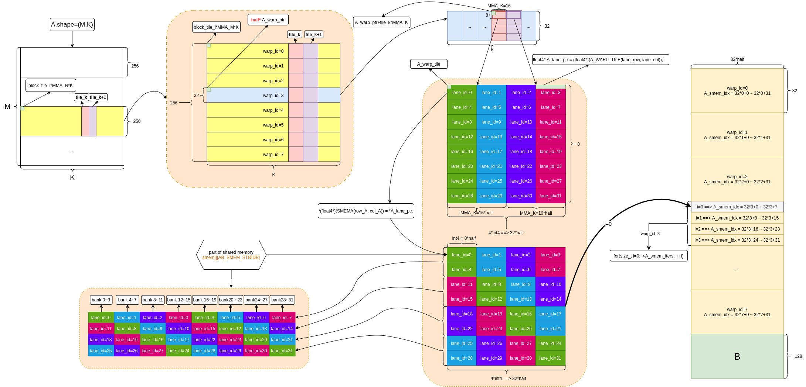
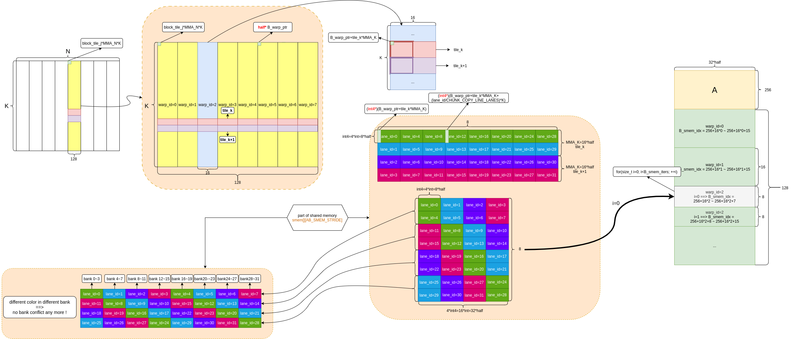
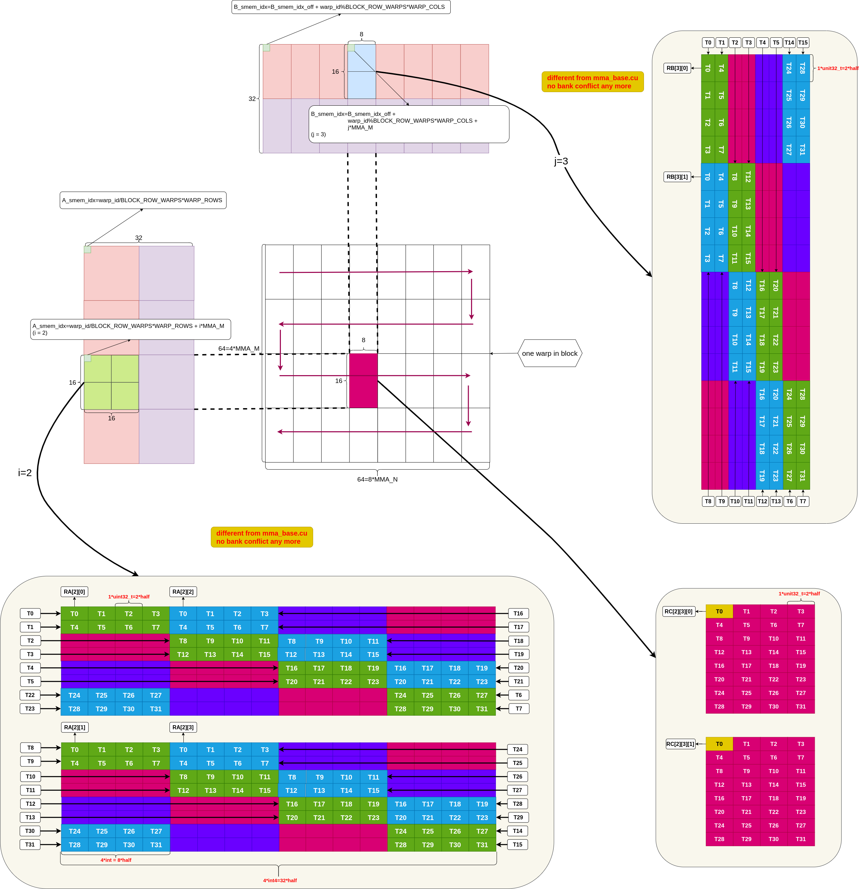
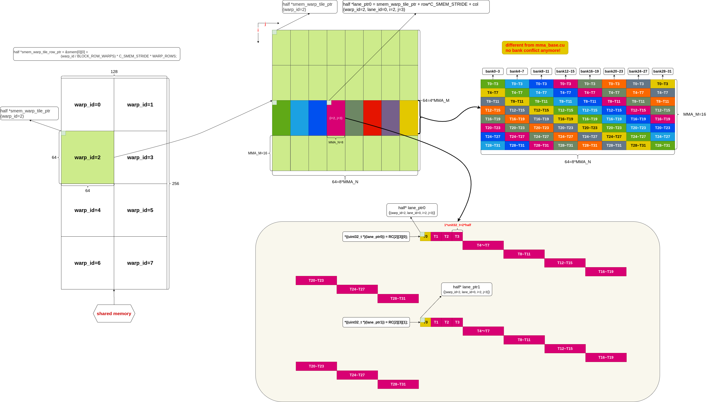
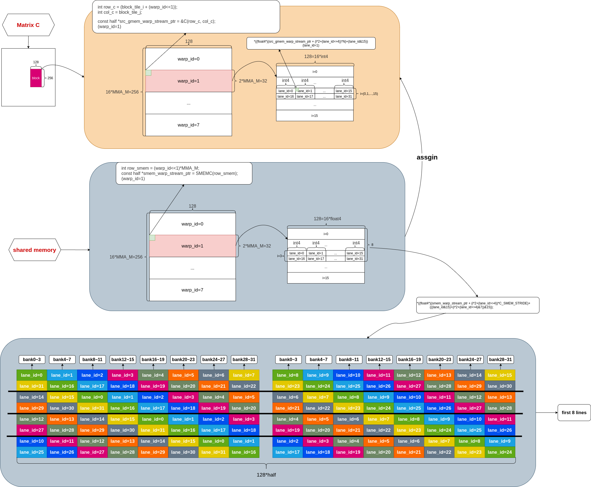
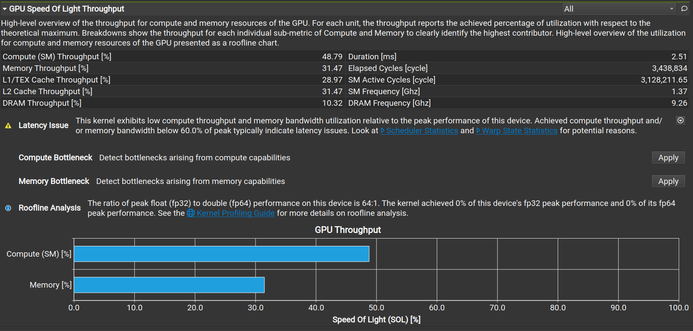
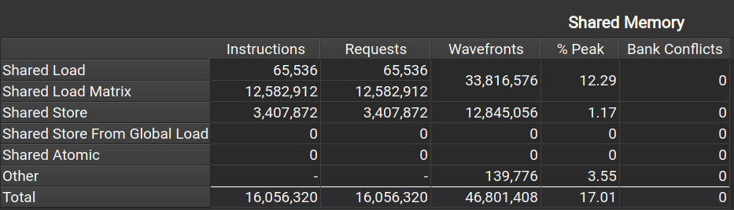

## mma_permuted

与 mma_base.cu 相比，permuted 版本的目的是减少 ldmatrix 中 shared memory 的 bank conflict，也就是说跟 shared memory 相关的部分都做了改动，无关的部分全部一致，所以这里只对不同的部分进行分析，相同的不做冗余说明。

### load Matrix A & B from HBM to SRAM

#### load A to SRAM

```c++
/* 
    in permute version, only col_A different from ldgstsA_base, 
    considering bank conflict
*/
void __device__ __inline__ ldgstsA_permute(const size_t warp_id, const size_t lane_id, const half* A_warp_ptr, 
                                size_t tile_k, size_t K, half* smemA) {


    const half *A_warp_tile = A_warp_ptr+tile_k*MMA_K;

    int lane_row = lane_id>>2, lane_col=lane_id&3; 
    float4* A_lane_ptr = (float4*)(A_WARP_TILE(lane_row, lane_col));

    /* 
        only col_A is different from ldgstsA_base:
        ((row_A&7)>>1) = [0,0, 1,1, 2,2, 3,3]
        this is actually col offset
        the final '&3' is to reverse the residual to the beginning
    */
    size_t row_A = (warp_id<<5)+lane_row;
    size_t col_A = ((lane_col+((row_A&7)>>1))&3)<<3;

    #pragma unroll
    for (size_t i = 0; i < 4; ++i) {
        *(float4*)(SMEMA(row_A, col_A)) = *A_lane_ptr;

        A_lane_ptr = (float4*)((half *)A_lane_ptr + LDGSTS_CP_ROWS*K);
        row_A += LDGSTS_CP_ROWS;
    }
}
```

* Figure-1 是 A 矩阵从 global memory 搬运到 shared memory 的过程

  

<center> Figure-1 <center>

* 很显然，与 base 版本相比，不同颜色的数据块被搬运到不同 bank 上，这个过程就是 permute

  * **<font color='red'> 值得注意的是，直到 ldmatrix 的时候才会看到减少 bank conflict 的收益</font>**

    


#### load B to SRAM

```c++
/*
    in permute version, only col_B different from ldgstsB_base, 
    considering bank conflict
*/
void __device__ __inline__ ldgstsB_permute(const size_t warp_id, const size_t lane_id, const half* B_warp_ptr, 
                        size_t tile_k, size_t K, half* smemB) {

    const half *B_warp_tile = B_warp_ptr+tile_k*MMA_K;

    int lane_row = lane_id&3, lane_col=lane_id>>2; 
    float4* B_lane_ptr = (float4*)(B_WARP_TILE(lane_row, lane_col));

    /* 
        ((row_B&7)>>1) = [0,0, 1,1, 2,2, 3,3]
        the same as row_A, this is actually col offset
        the final '&3' is to reverse the residual to the beginning
    */
    size_t row_B = (warp_id<<4)+lane_col;
    size_t col_B = ((lane_row+((row_B&7)>>1))&3)<<3; 

    #pragma unroll
    for (size_t i = 0; i < 2; ++i) {
        // load current data
        *(float4*)(SMEMB(row_B, col_B)) = *B_lane_ptr;

        // prepare the next 8 rows 
        B_lane_ptr = (float4*)((half *)B_lane_ptr + LDGSTS_CP_ROWS* K);
        row_B += LDGSTS_CP_ROWS;
    }
}
```


* Figure-2 是 B 矩阵对应的计算部分从 global memory 搬移到 shared memory

  

<center> Figure-2 <center>
* **<font color='red'> 同矩阵 A 的搬运过程一样，直到 ldmatrix 的时候才会看到减少 bank conflict 的收益</font>**

### load Matrix A & B from SRAM to Register

#### load A to Register

```c++
/* load Matrix A data from SRAM to Register:
   in permute version, 
   only lane_col is different, considering bank conflict */
void __device__ __inline__ ldsA_permute(int i, int k_step, 
                                const size_t warp_id, const size_t lane_id,
                                half* smemA, uint32_t RA[WARP_COL_TILES][4]) {

    size_t warp_row = (warp_id>>1)*WARP_ROWS + i*MMA_M;
    size_t warp_col = k_step*MMA_K;

    /*  
        (((lane_id&15)&7)>>1)<<3;
        ((lane_id&15)&7) = ([0,1,...,7,      0,1,...,7,       0,1,...,7,       0,1,...,7])>>1
                         = [0,0,1,1,...,3,3, 0,0,1,1,...,3,3, 0,0,1,1,...,3,3, 0,0,1,1,...,3,3]
        the final '&31' is to take the residual to the beginning position
    */
    size_t lane_row = warp_row + (lane_id&15);
    size_t lane_col = warp_col + ((lane_id>>4)<<3) + ((((lane_id&15)&7)>>1)<<3);
    lane_col &= 31; 

    uint32_t A_smem_lane_addr =
        __cvta_generic_to_shared(SMEMA(lane_row, lane_col));

    LDMATRIX_X4(RA[i][0], RA[i][1], RA[i][2], RA[i][3], A_smem_lane_addr);
}
```


#### load B to Register

```c++
/* load Matrix B data from SRAM to Register:
    in permute version, 
    only lane_col is different, considering bank conflict */
void __device__ __inline__ ldsB_permute(int j, int k_step, 
                                const size_t warp_id, const size_t lane_id,
                                half* smemB, uint32_t RB[WARP_ROW_TILES][2]) {

    size_t warp_row = (warp_id&1)*WARP_COLS + j*MMA_N;
    size_t warp_col = k_step*MMA_K;

    size_t lane_row = warp_row + (lane_id&7);
    size_t lane_col = warp_col + (((lane_id>>3)&1)<<3) + ((((lane_id&7)&7)>>1)<<3);
    lane_col &= 31; 

    uint32_t B_smem_lane_addr =
        __cvta_generic_to_shared(SMEMB(lane_row, lane_col));

    LDMATRIX_X2(RB[j][0], RB[j][1], B_smem_lane_addr);
}
```

Figure-3 是 warp 的布局以及 shared memory 搬移到 Register



<center> Figure-3 <center>

* [知乎作者木子知关于避免 bank conflict 的描述](https://zhuanlan.zhihu.com/p/639297098)
  * 如果加载到Shared Memory时进行Permuted操作，再使用ldmatrix PTX指令从Shared Memory加载到寄存器，会避免Bank Conflict的发生


### load result from Register to SRAM

```c++
/* store Matrix C result from Register RC to SRAM */
void __device__ __inline__ stsC_permute(int i, int j, const size_t warp_id, const size_t lane_id, 
                                        half* smem_warp_tile_ptr, 
                                        uint32_t RC[WARP_COL_TILES][WARP_ROW_TILES][2]) {

    int row = i*MMA_M + (lane_id>>2);
    int col = j*MMA_N;
    int warp_offset = (warp_id&1)*C_SMEM_OFFSET;

    /* 
        (lane_id>>2)&7 = [0,0,0,0, 1,1,1,1, ..., 7,7,7,7]
        this is offset of permute of cols
    */
    half *lane_ptr0 = smem_warp_tile_ptr + row*C_SMEM_STRIDE + 
                      ((warp_offset + col +
                      (lane_id&3) * sizeof(uint32_t) / sizeof(half) + 
                      (((lane_id>>2)&7)<<3))&127);

    half *lane_ptr1 = smem_warp_tile_ptr + (row+8) * C_SMEM_STRIDE +
                      ((warp_offset + col +
                      (lane_id&3) * sizeof(uint32_t) / sizeof(half) + 
                      ((((lane_id>>2)+8)&7)<<3))&127);

    *((uint32_t *)(lane_ptr0)) = RC[i][j][0];
    *((uint32_t *)(lane_ptr1)) = RC[i][j][1];
}
```

Figure-4 是结果数据从寄存器拷贝到 shared memory 的过程



<center> Figure-4 <center>

* 从 shared memory 布局上可以看出来，同一个 warp 的数据(同样颜色) 分布在不同的 bank 上，所以不会出现 bank conflict

### load result from SRAM to HBM

```c++
/* store Matrix C result from SRAM to HBM */
void __device__ __inline__ ldsC_permute(int i, const int N, 
                                        const size_t lane_id, 
                                        const half* src_gmem_warp_stream_ptr,
                                        const half* smem_warp_stream_ptr) {
    // tid=0, 1, ...,15 ==> lane_id/16=0
    // tid=16,17,...,31 ==> lane_id/16=1

    /*  
        lane_id>>4 = [0,0,0,0, 1,1,1,1, ..., 7,7,7,7]
        (lane_id>>4)&7 = [0,0,0,0, 1,1,1,1, ..., 7,7,7,7]
    */
    *((float4*)(src_gmem_warp_stream_ptr + (i*2+(lane_id>>4))*N)+(lane_id&15)) =
        *((float4*)(smem_warp_stream_ptr + (i*2+(lane_id>>4))*C_SMEM_STRIDE)+
              (((lane_id&15)+(i*2+(lane_id>>4)&7))&15));

}
```

Figure-5 是结果数据从 shared memory 拷贝到 global memory 的过程



<center> Figure-5 <center>

* **<font color='red'> 有个疑问：按道理，这里对 shared memory 读取数据的时候应该有 4-way bank conflict，但 ncu 指标上完全没有 bank conflict</font>**

  

### Performance

测试的矩阵尺寸为 M=N=K=4096

Figure-6 是 permute 版本的 ncu 性能指标



<center> Figure-6 <center>

* 耗时2.51ms，相对于 base 版本有提升

Figure-7 是 permute 版本的 memory 指标



<center> Figure-7 <center>

* 完全没有 bank conflict


